# CodeAIx+ - Advanced Code Analysis & Development Platform

## Overview

CodeAIx+ is an enterprise-grade extension of the CodeAIx platform, designed to provide developers with comprehensive tools for code analysis, debugging, and optimization. Built with a focus on code quality and developer productivity, CodeAIx+ combines powerful AI-driven analysis with an intuitive user interface to create a seamless development experience for professionals at all skill levels.

## Architecture

```mermaid
%%{init: {
    'theme': 'neutral', 
    'themeVariables': {
        'primaryColor': '#F0F4F8', 
        'primaryTextColor': '#1A365D', 
        'secondaryColor': '#E2E8F0',
        'tertiaryColor': '#4A5568',
        'lineColor': '#2D3748',
        'fontFamily': 'Inter, Arial, sans-serif',
        'fontSize': '16px'
    }
}}%%
flowchart TD
        %% ================================
        %% Main System Container
        %% ================================
        A([CodeAIx Platform])
        A --- B{Core Architecture}
        
        %% ================================
        %% Security & Authentication Subsystem
        %% ================================
        subgraph "Security & Authentication"
                direction TB
                SEC([Security Layer])
                VERIFY[User Verification]
                AUTH[Google Authentication]
                DB1[(User Database)]
                DB2[(Code Repository)]
                
                SEC --> VERIFY
                VERIFY --> AUTH
                AUTH <--> DB1
                AUTH <--> DB2
        end

        %% ================================
        %% Core Models
        %% ================================
        B --> |Execution Model| C[CodeAIx: Streamlined Execution]
        B --> |Analysis Model| D[CodeAIx+: Advanced Analysis]
        
        %% ================================
        %% CodeAIx Core Features
        %% ================================
        subgraph "CodeAIx Core Features"
                direction TB
                API1[Rapid API Integration]
                EXEC[Real-Time Execution]
                PERF1[Performance Monitoring]
                UI1[Responsive Interface]
                LANG[Multi-Language Support]
        end
        
        %% ================================
        %% CodeAIx+ Advanced Capabilities
        %% ================================
        subgraph "CodeAIx+ Advanced Capabilities"
                direction TB
                GEMINI[AI-Powered Analysis]
                DEBUG[Advanced Debugging]
                OPT[Code Optimization]
                METRICS[Performance Metrics]
                CONVERT[Language Conversion]
        end
        
        %% ================================
        %% Integration Ecosystem
        %% ================================
        subgraph "Integration Ecosystem"
                direction TB
                GITHUB[GitHub Access]
                SOCIAL[Social Sharing]
                DEVICE[Device Integration]
        end
        
        %% ================================
        %% Developer Support
        %% ================================
        subgraph "Developer Support"
                direction TB
                CHAT[Intelligent Chatbot]
                FORUM[Community Forum]
        end

        %% ================================
        %% Establishing Connections
        %% ================================
        %% Core system connects to the security layer.
        A --> SEC

        %% Execution and Analysis models incorporate core features.
        C --> API1 & EXEC & PERF1 & UI1 & LANG
        D --> GEMINI & DEBUG & OPT & METRICS & CONVERT

        %% Integration ecosystem and support services are accessible via both models.
        C & D --> GITHUB
        C & D --> SOCIAL
        C & D --> DEVICE
        C & D --> CHAT
        C & D --> FORUM

        %% ================================
        %% Styling Definitions
        %% ================================
        classDef mainNode fill:#E6F2FF, stroke:#2C5282, stroke-width:3px, color:#1A365D, font-weight:bold;
        classDef modelNode fill:#EBF8FF, stroke:#3182CE, stroke-width:2px, color:#2C5282, font-weight:600;
        classDef featureNode fill:#F0FFF4, stroke:#48BB78, stroke-width:1.5px, color:#276749;
        classDef infrastructureNode fill:#F7FAFC, stroke:#4A5568, stroke-width:1.5px, color:#2D3748;

        class A mainNode;
        class B modelNode;
        class C,D modelNode;
        class API1,EXEC,PERF1,UI1,LANG,GEMINI,DEBUG,OPT,METRICS,CONVERT featureNode;
        class SEC,VERIFY,AUTH,DB1,DB2,GITHUB,SOCIAL,DEVICE,CHAT,FORUM infrastructureNode;
```

## Key Features

### Intelligent Code Processing
- **Automatic Language Detection**: The platform uses sophisticated algorithms to instantly identify programming languages without requiring manual configuration. This saves developers valuable time and reduces the friction of working with multilingual codebases.
- **Cross-Language Conversion**: CodeAIx+ enables seamless translation of code between multiple programming languages, supporting JavaScript, Python, Java, C++, Ruby, Go, and many others. This feature is particularly valuable for teams working across different technology stacks or developers learning new languages.

### Advanced Code Analysis
- **Comprehensive Debugging**: Powered by Google Gemini's advanced AI capabilities, CodeAIx+ provides in-depth error detection and resolution that goes beyond surface-level issues. The system analyzes code context, identifies root causes, and suggests precise fixes with explanations.
- **Quality Assessment**: The platform evaluates code across multiple dimensions to ensure optimal quality:
  - **Consistency**: Analyzes adherence to style guides and naming conventions, promoting readability and maintainability across teams
  - **Performance optimization**: Identifies inefficient algorithms, unnecessary operations, and resource-intensive patterns
  - **Documentation quality**: Evaluates comments, docstrings, and API documentation for completeness and clarity
  - **Error handling robustness**: Assesses exception handling, edge cases, and input validation
  - **Modularity and maintainability**: Examines code structure, function length, and separation of concerns
  - **Complexity management**: Calculates cyclomatic complexity, cognitive complexity, and suggests simplifications

### Performance Optimization
- **Detailed Metrics**: CodeAIx+ goes beyond simple execution by monitoring critical performance indicators including memory usage patterns, execution time breakdowns, and potential bottlenecks. These insights help developers make informed decisions about optimizing resource-intensive sections of code.
- **Error Diagnostics**: The platform's sophisticated diagnostic tools identify and help resolve complex runtime issues such as memory leaks, race conditions, deadlocks, and asynchronous execution problems that might otherwise require extensive manual debugging.

### Modern Development Environment
- **Intuitive Interface**: The platform features a clean, responsive design that scales seamlessly across devices, from desktop workstations to tablets. The thoughtfully designed workspace prioritizes code visibility while keeping powerful tools readily accessible.
- **AI-Assisted Development**: Deeply integrated with the CodeMitra chatbot, CodeAIx+ provides contextual, real-time programming assistance. Developers can ask questions about their code, request explanations, or seek best practice recommendations without leaving their workflow.

### Collaborative Tools
- **GitHub Integration**: CodeAIx+ offers seamless repository access, commit management, and code sharing capabilities directly within the platform. This integration streamlines the development workflow and reduces context switching between tools.
- **Community Forum**: The built-in knowledge exchange platform facilitates developer collaboration through discussions, code reviews, and shared solutions to common challenges. This community-driven resource grows more valuable over time.
- **Secure Authentication**: Implementation of Google Authentication with MongoDB Atlas ensures robust data security and user management, providing peace of mind for organizations with sensitive intellectual property.

